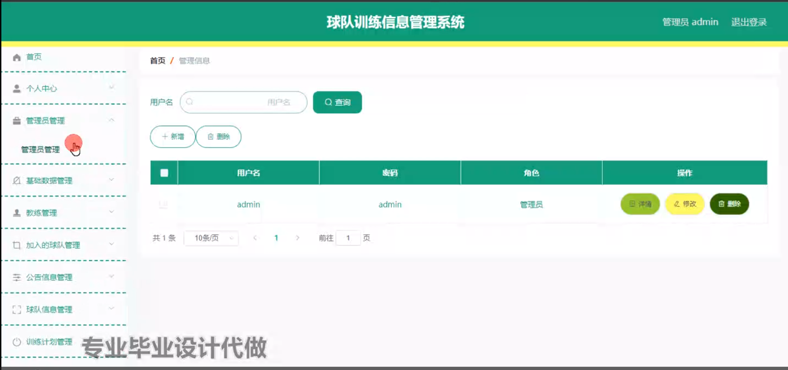

# 毕业设计-基于springboot的球队训练信息管理系统

#### 系统概要

该基于SpringBoot的球队训练信息管理系统，是一个全面、高效的信息管理平台，旨在优化球队的日常训练、管理和比赛准备流程。系统通过集成三种角色——管理端、教练端和球员端——的功能模块，实现了信息的集中管理和分层访问，确保了球队运营的高效与透明。

#### 研究背景

当前的网络技术，软件技术等都具备成熟的理论基础，市场上也出现各种技术开发的软件，这些软件都被用于各个领域，包括生活和工作的领域。随着电脑和笔记本的广泛运用，以及各种计算机硬件的完善和升级，市面上的电脑和笔记本的性能都得到提升，可以支持的软件也逐渐增多，因此，在计算机上安装软件来发挥其高效地信息处理的作用，则很受人们的青睐。对于球队训练信息管理系统信息来讲，通过手工形式处理，在面对庞大的信息数量时，就显得不适宜了，首先需要花费的时间比较多，其次数据出错率比较高，而且对错误的数据进行更改也比较困难，最后，检索数据费事费力。因此，为了解决上述问题，有必要建立球队训练信息管理系统，来规范球队训练信息管理系统信息管理流程，让管理工作可以系统化和程序化，同时，球队训练信息管理系统的有效运用可以帮助管理人员准确快速地处理信息。

#### 技术栈

后端技术栈：Springboot+Mysql+Maven

前端技术栈：Vue+Html+Css+Javascript+ElementUI

开发工具：Idea+Vscode+Navicate

#### 系统功能介绍

管理端  
个人中心：提供账户信息的修改与查看。  
管理员管理：负责管理端用户权限的设定与管理。  
基础数据管理：包括球队基本信息、球员资料、训练设施等的维护。  
教练管理：管理教练信息，包括招聘、培训、考核等。  
加入的球队管理：维护球队成员名单，处理球员的加入与退出。  
公告信息管理：发布球队通知、赛事安排、训练调整等信息。  
球队信息管理：维护球队的档案资料，包括历史战绩、荣誉记录等。  
训练计划管理：制定和调整训练计划，包括体能、技能、战术训练等。  
训练进度管理：监控训练执行情况，评估训练效果。  
比赛首发名单：管理比赛日的首发阵容，包括替补名单。  
考勤信息管理：记录球员的出勤情况，包括迟到、早退、请假等。  

教练端  
个人中心：查看与修改个人资料。   
加入的球队管理：了解球队的成员构成与变动情况。  
公告信息管理：接收球队公告，包括训练调整和比赛信息。  
球队信息管理：了解球队的历史和当前状态。  
训练计划管理：制定训练内容，包括体能、技能训练计划。  
训练进度管理：跟踪训练进度，评估球员表现。  
比赛首发名单：参与首发阵容的制定与讨论。  
考勤信息管理：监督球员的出勤情况，维护纪律。  

球员端  
个人中心：管理个人资料，包括联系方式和健康状况。  
教练管理：查看教练信息，了解教练团队的构成。  
加入的球队管理：了解球队的成员信息和变动情况。  
公告信息管理：接收球队通知，包括训练调整、比赛安排。  
训练进度管理：查看个人的训练记录和进度反馈。  
比赛首发名单：查看比赛日的首发名单，了解自己的上场机会。  
球队信息管理：了解球队的历史和当前状态。  
训练计划管理：查看训练安排，准备相应的装备和心理状态。  
考勤信息管理：记录个人的出勤情况，确保遵守球队纪律。  

#### 功能结构设计

为了让系统的编码可以顺利进行，特意对本系统功能进行细分设计，设计的系统功能结构见下图。

#### 系统流程分析

本系统在处理数据时，其内部的操作逻辑也需要使用相应的工具进行展示。
在本系统的数据录入页面，对于操作者提供的每条数据都有相应的检验规则，比如数据信息不能有非法字符，或者本来应该是汉字的数据，不能用字母代替，还有对数据内容的长度等进行规范，这样的可以确保数据准确性的检验规则，在编码时，就提前编写好了。数据添加的流程见下图。如果数据已经保存进入数据库，则说明操作者提供的数据内容和格式都是符合要求的。

很多时候，面对系统中的大量数据，难免会发现一些错误，因此需要及时纠正错误，本系统也提供数据后期的修改功能，其流程见下图。但是更新的数据也需要通过数据有效性检验。能够最终写入数据库则说明修改的数据是符合要求的。

面对数据库里面大量数据，在系统的前台，要想快速获取需要的信息，就需要使用查询功能。其流程见下图。该功能需要操作者提前输入关键词，当系统的后台数据库保存了与关键词匹配的数据时，就会及时显示出来，整个过程耗时很短。

#### 系统作用

本系统通过精细化的角色划分与功能模块设计，不仅为用户提供了一个简洁高效的博客创作与分享平台，还大大提升了管理员对系统内容的监管能力。对于用户而言，系统降低了使用门槛，提升了创作与交流的便利性；对于管理员而言，则通过强大的后台管理工具，实现了对系统内容的全面掌控与高效管理。此外，系统还支持灵活的扩展与定制，能够根据不同场景的需求进行快速调整与优化。

#### 系统功能截图

登录

管理员管理

教练管理

加入的球队管理

公告信息管理

球队信息管理

训练计划管理

训练进度管理

比赛首发名单

考勤信息管理

球员管理

#### 总结

本研究在深入分析当前博客系统存在问题的基础上，设计并实现了一个基于Spring Boot的精简博客系统。该系统通过明确的功能模块划分与精细的权限管理，有效解决了传统博客系统在功能复杂性与管理灵活性方面的不足。系统不仅提升了用户的使用体验，还为管理员提供了强大的后台管理工具，确保了系统的有序运行与内容的优质呈现。未来，我们将继续关注用户需求与技术发展，不断优化系统功能，提升系统性能，为用户提供更加优质的服务体验。

#### 使用说明

创建数据库，执行数据库脚本 修改jdbc数据库连接参数 下载安装maven依赖jar 启动idea中的springboot项目

后台登录页面
http://localhost:8080/qiuduixunlianxinxi/admin/dist/index.html

管理员				账户:admin 		密码：admin

教练				账户:a1 		密码：123456

球员				账户:a1 		密码：123456
